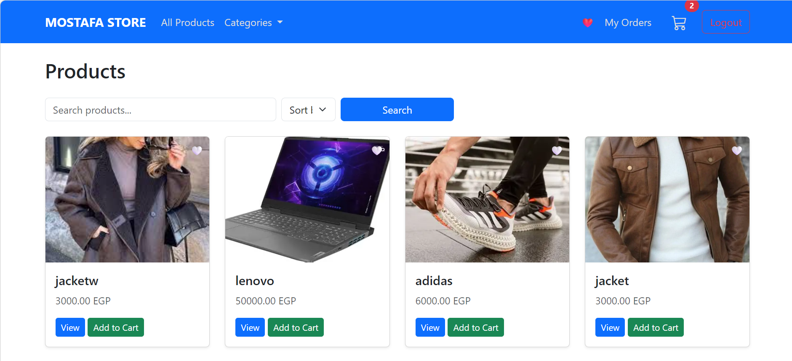
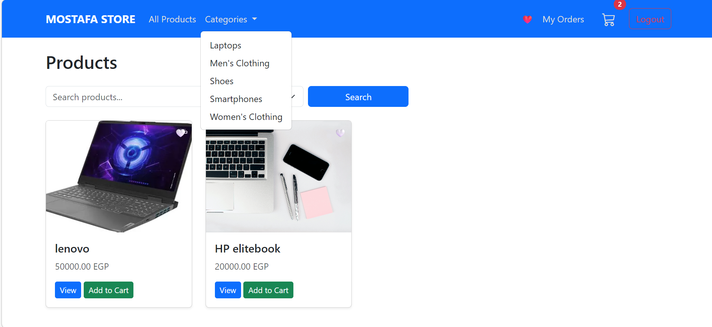
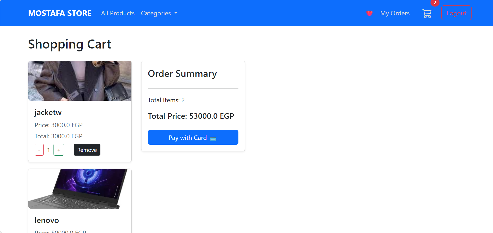
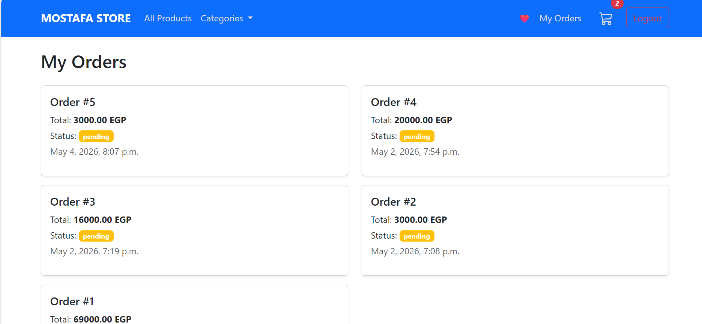
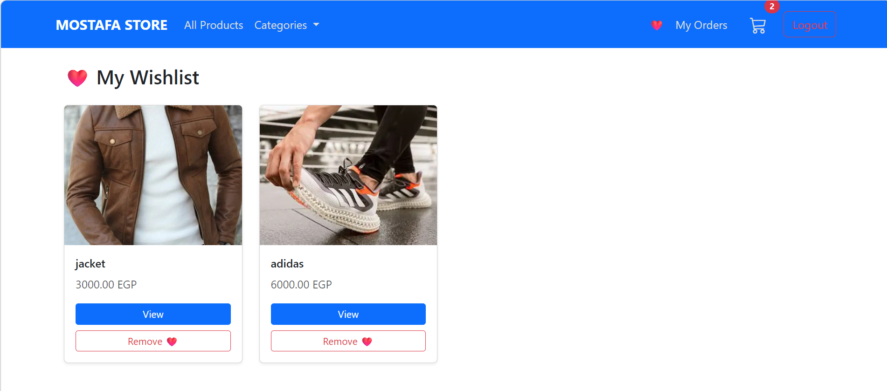
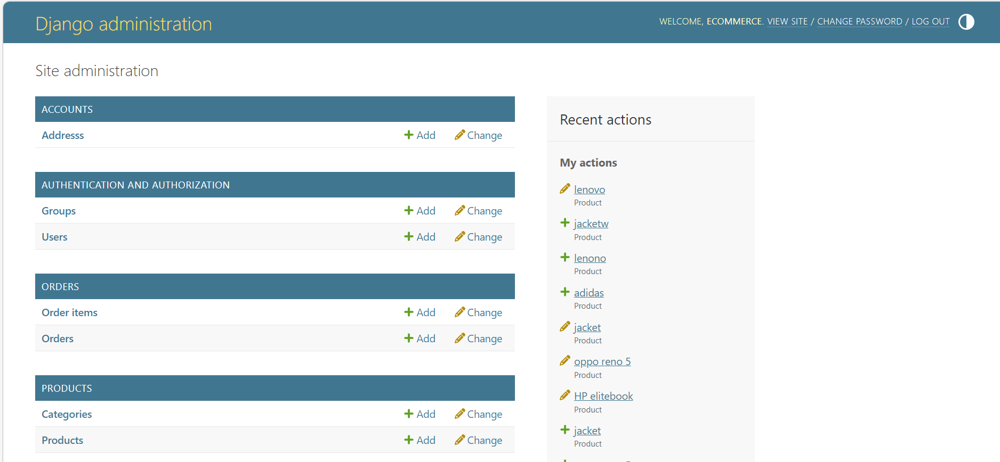

<div align="center">

# 🛒 Django Core Commerce

### A high-performance, Full-Stack E-commerce engine architected for scalability and secure transactions.

[](https://www.python.org/)
[](https://www.djangoproject.com/)
[](https://www.postgresql.org/)
[](https://stripe.com/)
[](LICENSE)

<br/>

> Built to demonstrate real-world backend engineering: clean architecture, secure payments, and production-ready patterns.

<br/>

[Features](#-features) · [Architecture](#-system-architecture) · [API Endpoints](#-api--url-reference) · [Getting Started](#-getting-started) · [Security](#-security-details) · [Contributing](#-contributing)

</div>

---

## 📸 Project Preview

| Product Catalog | Categoires | Cart | Order History | Wishlist | Administrative Dashboard |
|:-:|:-:|:-:|:-:|:-:|:-:|
|  |  |  |  |  |  |

---

## ✨ Features

### 🛠 Backend Engineering
- **Dynamic Catalog System** — Advanced filtering, full-text search, and multi-criteria sorting (price, newest, popularity)
- **Session-Managed Cart** — Persistent cart state across browsing sessions with zero redundant DB hits
- **Relational Schema** — Normalized, PostgreSQL-ready schema handling `User → Order → Product` relationships cleanly
- **Wishlist Engine** — Per-user item persistence with dynamic UI feedback, no page reloads

### 💳 Payments & Security
- **Stripe Integration** — Production-grade checkout using Stripe Checkout Sessions + Webhooks for real-time order confirmation
- **Custom Authentication** — Registration, login, logout with protected views and CSRF-secure forms
- **Environment Safety** — Full `.env` decoupling of all secrets — zero hardcoded credentials
- **Object-Level Permissions** — Users can only access and manage their own orders and wishlist

### ⚡ Performance
- `select_related()` and `prefetch_related()` used throughout to eliminate the N+1 query problem
- Session-based cart avoids unnecessary DB writes on every cart interaction
- Querysets are paginated to handle large product catalogs efficiently

---

## 🏗 System Architecture

```text
Django-Core-Commerce/
│
├── ⚙️  core/               # Project configuration, settings, security, and root URLs
│    ├── settings.py        # Environment-aware settings (DEBUG, DB, Stripe keys)
│    └── urls.py            # Root URL dispatcher
│
├── 📦  products/           # Catalog management
│    ├── models.py          # Product, Category models
│    ├── views.py           # List, detail, filter, search logic
│    ├── urls.py
│    └── templates/
│
├── 🛒  cart/               # Session-based shopping cart
│    ├── cart.py            # Core Cart class (session management)
│    ├── views.py           # Add / update / remove / clear actions
│    ├── urls.py
│    └── templates/
│
├── 💳  orders/             # Transaction handling
│    ├── models.py          # Order, OrderItem models
│    ├── views.py           # Checkout, Stripe session, webhook handler
│    ├── urls.py
│    └── templates/
│
├── 👤  accounts/           # User lifecycle & Wishlist
│    ├── models.py          # Wishlist model
│    ├── views.py           # Register, login, logout, profile, wishlist
│    ├── forms.py           # Custom auth forms
│    ├── urls.py
│    └── templates/
│
├── 🎨  templates/          # Base layout + per-app templates
├── 📂  static/             # CSS / JS / Images
├── .env.example            # Environment variable template
├── requirements.txt
└── manage.py
```

---

## 🛠 Tech Stack

| Layer | Technology | Purpose |
|---|---|---|
| Language | Python 3.11+ | Core language |
| Framework | Django 4.2+ | Web framework & ORM |
| Database | PostgreSQL / SQLite | Relational data storage |
| Payments | Stripe | Checkout & Webhook processing |
| Auth | Django Auth | Session-based user management |
| Frontend | Django Templates + CSS | Server-side rendered UI |
| Environment | python-decouple / dotenv | Secrets management |

---

## 🚀 Getting Started

### Prerequisites

- Python 3.11+
- pip
- A [Stripe](https://stripe.com) account (for payment features)

### Installation

**1. Clone the repository**

```bash
git clone https://github.com/Dev-Mostafa-Mohamed/Django-Core-Commerce.git
cd django-core-commerce
```

**2. Create and activate a virtual environment**

```bash
python -m venv ecommerce_env
# Windows
ecommerce_env\Scripts\activate
# macOS / Linux
source venv/bin/activate
```

**3. Install dependencies**

```bash
pip install -r requirements.txt
```

**4. Configure environment variables**

```bash
cp .env.example .env
```

Open `.env` and fill in your values:

```env
SECRET_KEY=your-django-secret-key
DEBUG=True

DATABASE_URL=sqlite:///db.sqlite3   # or your PostgreSQL URL

STRIPE_PUBLIC_KEY=pk_test_...
STRIPE_SECRET_KEY=sk_test_...
STRIPE_WEBHOOK_SECRET=whsec_...
```

**5. Apply migrations**

```bash
python manage.py migrate
```

**6. Load sample data (optional)**

```bash
python manage.py loaddata fixtures/sample_products.json
```

**7. Create a superuser**

```bash
python manage.py createsuperuser
```

**8. Run the development server**

```bash
python manage.py runserver
```

Visit `http://127.0.0.1:8000/` — the store is live. ✅

---

## 📡 API & URL Reference

### Public Pages

| Method | URL | Description |
|---|---|---|
| `GET` | `/products/Homepage/` | product_list |
| `GET` | `/<int:pk>/<slug:slug>/` | Product detail page |
| `GET` | `/category/<slug:category_slug>/` | category_products |

### Cart

| Method | URL | Description |
|---|---|---|
| `GET` | `/cart/` | cart_detail |
| `POST` | `/cart/add/<product_id>/` | Add item to cart |
| `POST` | `/cart/update/<product_id>/` | Update item quantity |
| `POST` | `/cart/remove/<product_id>/` | Remove item from cart |

### Orders & Checkout

| Method | URL | Description | Auth Required |
|---|---|---|---|
| `GET` | `/orders/checkout/` | Checkout page | ✅ Yes |
| `POST` | `/orders/create-checkout-session/` | Create Stripe session | ✅ Yes |
| `GET` | `/orders/success/` | Order success page | ✅ Yes |
| `GET` | `/orders/history/` | User's order history | ✅ Yes |
| `POST` | `/orders/webhook/` | Stripe webhook handler | Stripe Only |

### Accounts & Wishlist

| Method | URL | Description | Auth Required |
|---|---|---|---|
| `GET/POST` | `/accounts/register/` | User registration | No |
| `GET/POST` | `/accounts/login/` | User login | No |
| `GET` | `/accounts/logout/` | User logout | ✅ Yes |
| `GET` | `/accounts/profile/` | User profile & order summary | ✅ Yes |
| `POST` | `/accounts/wishlist/add/<id>/` | Add product to wishlist | ✅ Yes |
| `POST` | `/accounts/wishlist/remove/<id>/` | Remove from wishlist | ✅ Yes |
| `GET` | `/accounts/wishlist/` | View wishlist | ✅ Yes |

---

## 💳 Stripe Payment Flow

```
User clicks "Checkout"
        │
        ▼
POST /orders/create-checkout-session/
        │
        ▼
Stripe Checkout Session created
        │
        ▼
User completes payment on Stripe-hosted page
        │
        ▼
Stripe sends POST to /orders/webhook/
        │
        ▼
Order confirmed → status updated → confirmation email sent
        │
        ▼
User redirected to /orders/success/
```

**Setting up the Stripe webhook locally:**

```bash
# Install Stripe CLI
stripe listen --forward-to localhost:8000/orders/webhook/
```

---

## 🔒 Security Details

**Session-based cart** — Cart data lives in the Django session, not in the URL or cookies, preventing tampering:

```python
# cart/cart.py
class Cart:
    def __init__(self, request):
        self.session = request.session
        cart = self.session.get('cart')
        if not cart:
            cart = self.session['cart'] = {}
        self.cart = cart
```

**Webhook signature verification** — All Stripe events are verified using the webhook secret before processing:

```python
event = stripe.Webhook.construct_event(
    payload, sig_header, settings.STRIPE_WEBHOOK_SECRET
)
```

**Object-level access control** — Users can only view their own orders:

```python
order = get_object_or_404(Order, id=order_id, user=request.user)
```

**Login-required views** — All sensitive views are protected:

```python
@login_required
def order_history(request):
    ...
```

---

## 📊 HTTP Status Codes

| Code | Meaning |
|---|---|
| `200 OK` | Successful page load |
| `201 Created` | Order placed successfully |
| `302 Found` | Redirect after form submission |
| `400 Bad Request` | Form validation error |
| `401 Unauthorized` | Login required |
| `403 Forbidden` | Authenticated but not the owner |
| `404 Not Found` | Product or order does not exist |

---

## 🗄 Database Schema (Simplified)

```
User (Django built-in)
 └──< Order
        └──< OrderItem >──── Product >──── Category
 └──< Wishlist >──────────── Product
```

| Model | Key Fields |
|---|---|
| `Product` | `name`, `slug`, `price`, `stock`, `category`, `image` |
| `Category` | `name`, `slug` |
| `Order` | `user`, `status`, `stripe_session_id`, `created_at` |
| `OrderItem` | `order`, `product`, `quantity`, `price` |
| `Wishlist` | `user`, `products` (M2M) |

---

## 🤝 Contributing

Contributions are welcome! Please follow these steps:

1. Fork the repository
2. Create a feature branch: `git checkout -b feature/your-feature-name`
3. Commit your changes: `git commit -m "feat: add your feature"`
4. Push to your branch: `git push origin feature/your-feature-name`
5. Open a Pull Request

Please make sure your code is clean and follows Django best practices.

---

## 📄 License

This project is licensed under the [MIT License](LICENSE).

---

<div align="center">

Made with ❤️ using Django & Python

⭐ If you found this project useful, please consider giving it a star!

</div>
